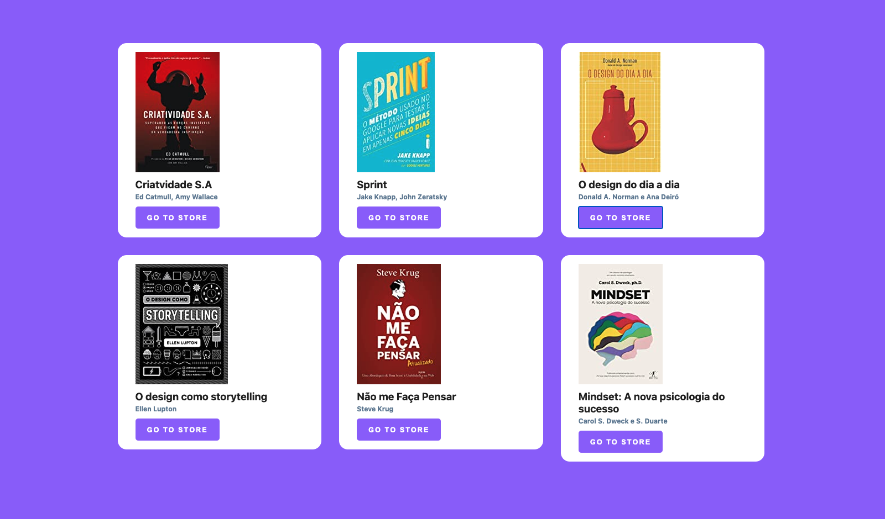

## BookList Component with React

This is a basic React Project with the purpose of learning the react components fundamentals

The app is a basic Book list component that shows a list of books as a bookshelf and has a
handler to take users to the Seller webpage.

Just very basic stuff !

## There is a live version demo hosted on netlify through the link below:

### [Live Demo on Netlify](https://b0oklist.netlify.app/)

## How to Run the project:

### `npm install`

### `npm start`

Runs the app in the development mode.\
Open [http://localhost:3000](http://localhost:3000) to view it in the browser.

To learn React, check out the [React documentation](https://reactjs.org/).

